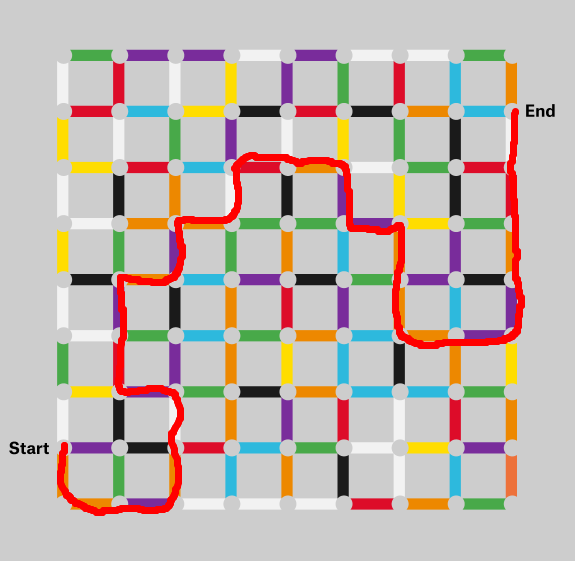

# Solution




# How I did it
I solved this week's puzzle using Raymond Hettinger's [generic puzzle
solver](https://rhettinger.github.io/puzzle.html), which he [presented at
PyCon](https://www.youtube.com/watch?v=_GP9OpZPUYc) a few weeks ago.

To use the solver, we need to subclass the `Puzzle` class and define the rules
our particular puzzle.  The code snippets below are all within the
`RiddlerMaze` subclass.

First, we need a way to represent the maze and our current position in it:

```python
STARTING_POS = """\
.g.p.p.w.p.w.w.g.
w r w y p g r b o
.r.b.y.k.r.k.o.b.
y w g p w y g k w
.y.r.b.r.o.w.g.r.
w k o w k p y k r
.w.o.o.g.g.p.y.g.
y g p g o b o p o
.k.o.b.p.k.g.p.k.
w p k o r p o b p
.w.g.b.g.o.b.o.p.
g r p o y b k o y
.y.p.g.k.o.b.b.g.
w k w o p r w r o
+p.k.r.b.g.w.y.p.
o g o b o k w b o
.o.p.w.w.w.r.o.g.
"""
```

The dots represent places where we can go in the maze (nodes on the graph), and
the letters represent the connections between those places (edges on the
graph).  In this schema, `b` is blue, `k` is black, and the other letters
correspond first letters of the other colors.  The `+` indicates our current
position.

Next, we need to be able to check whether we've reached the end of the maze:

```python
@property
def location(self):
    return divmod(self.pos.find("+"), N_COLS + 1)

def isgoal(self):
    return self.location == (2, 16)
```

Since the `+` indicates our current position, we just need to find it and check
if it's at the right location.


Finally, we need a way to generate the possible moves from a given position:

```python
def __iter__(self):
    current_row, current_col = self.location
    grid = self.pos.splitlines()
    for dx, dy in [(1, 0), (-1, 0), (0, 1), (0, -1)]:
        edge_row, edge_col = current_row + dx, current_col + dy
        on_grid = 0 <= edge_row < N_ROWS and 0 <= edge_col < N_COLS
        if not on_grid:
            continue
        ok_color = grid[edge_row][edge_col] in self.valid_edge_colors
        if on_grid and ok_color:
            new_row, new_col = current_row + 2*dx, current_col + 2*dy
            new_grid = [list(row) for row in grid]
            new_grid[current_row][current_col] = "."
            new_grid[new_row][new_col] = "+"
            new_pos = "\n".join("".join(row) for row in new_grid)
            yield RiddlerMaze(self.valid_edge_colors, new_pos)
```
The rules are that we can move in any of the four cardinal directions as long
as we stay on the grid and the edge we cross is an acceptable color.  Because
of the way I'm representing the maze, an edge is one step in a direction and
the corresponding node is two steps.

And. . . that's it.  We've defined the rules of the puzzle, and that's all we
need to solve it.  The base `Puzzle` class implements the searching algorithm.

It works by taking the starting position and generating the possible moves,
then doing the same for each of the generated positions, and so on.  This
creates a tree of possible paths through the maze, which the solver can
traverse depth-first or breadth-first.  For a maze, a depth-first search is
equivalent to the [right-hand
rule](https://en.wikipedia.org/wiki/Maze_solving_algorithm#Wall_follower), but
either method works.


##Blue
```
.g.p----------|g.
w r | y p g r | o
.r.b|y.k.r.k.o--+
y w | p w y g k w
.y.r|--r.o.w.g.r.
w k o | k p y k r
.w.o.o|----p.y.g.
y g p g o | o p o
.k.o.b.p.k|g.p.k.
w p k o r | o b p
.w.g.b.g.o|b.o.p.
g r p o y | k o y
.y.p.g.k.o|--b.g.
w k w o p r | r o
--|k.r------|y.p.
o | o | o k w b o
.o----|w.w.r.o.g.
```

##Yellow
```
.g.p.p.w.p------|
w r w y p | r b |
.r.b.y.k.r|k.o.b+
y w g p w | g k w
.y.r.b.r.o|--g.r.
w k o w k p | k r
------|g.g.p|y.g.
| g p | o b | p o
|k.o.b|p.k.g|p.k.
| p k | r p | b p
|w.g.b|g.o.b|--p.
| r p | y b k | y
|y.p|--k.o.b.b|--
| k | o p r w r |
|p.k|r.b----|y.p|
o g | b | k | b |
.o.p----|w.r----|
```

##Red
```
.g.p.p.w.p.w.w.g.
w r w y p g r b o
.r.b.y.k.r.k.o.b+
y w g p w y g k |
.y.r.b----|w.g.r|
w k o | k | y k |
.w.o--|g.g--|y.g|
y g | g o b | p |
.k--|b.p.k.g|p.k|
w | k o r p | b |
.w|g.b.g.o.b----|
g | p o y b k o y
.y|--g.k.o.b.b.g.
w k | o p r w r o
|p.k|r.b.g.w.y.p.
| g | b o k w b o
----|w.w.w.r.o.g.
```

My full code is in the `express.py` file in this directory, and Raymond
Hettinger's code is in `rhettinger_pycon_2019.py`.
