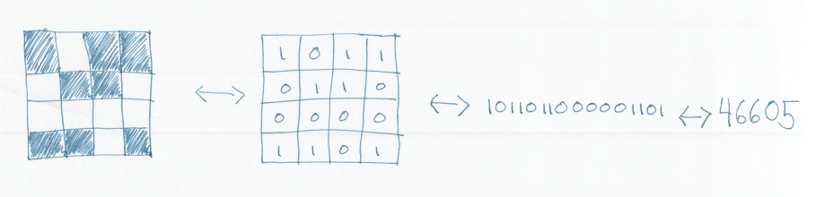
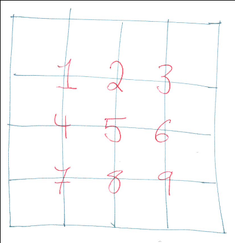

# Problem statement

You are given an empty 4-by-4 square and one marker. You can color in the
individual squares or leave them untouched. After you color as many or as few
squares as you’d like, I will secretly cut out a 2-by-2 piece of it and then
show it to you without rotating it. You then have to tell me where it was
(e.g., “top middle” or “bottom right,” etc.) in the original 4-by-4 square.

Can you design a square for which you’ll always know where the piece came from?

[Original
article](https://fivethirtyeight.com/features/can-you-construct-the-optimal-tournament/)


# My solution
There are 6188 solutions
The first one is Grid #720
```
□□□□
□□■□
■■□■
□□□□
```


# How I did it

All the code is in the [express.py](./express.py) file in this directory.

We'll want a way to enumerate the possible grids, so we can know which ones
we've already checked.  The grid has sixteen squares, each of which can be
filled or not filled.  Think of the squares as bits.  If we unstack the grid,
then, we get a 16-bit integer.  Similarly, we can take a 16-bit integer and
build the corresponding grid.  If we check all 2^16 of the 16-bit integers,
then, we'll have checked all the possible grids.



To check if a grid solves the puzzle, we'll check all the distinct two-by-two
subsets of the grid.  Each square that's isn't on the right or bottom edges of
the grid can be the top-left corner of a two-by-two subset.  That means for an
N-by-N grid, there are (N-1)^2 possible two-by-two subsets.  We can enumerate
and check all of these.  If there's a pattern that shows up twice in a given
grid, the grid isn't a solution; otherwise, it is.


