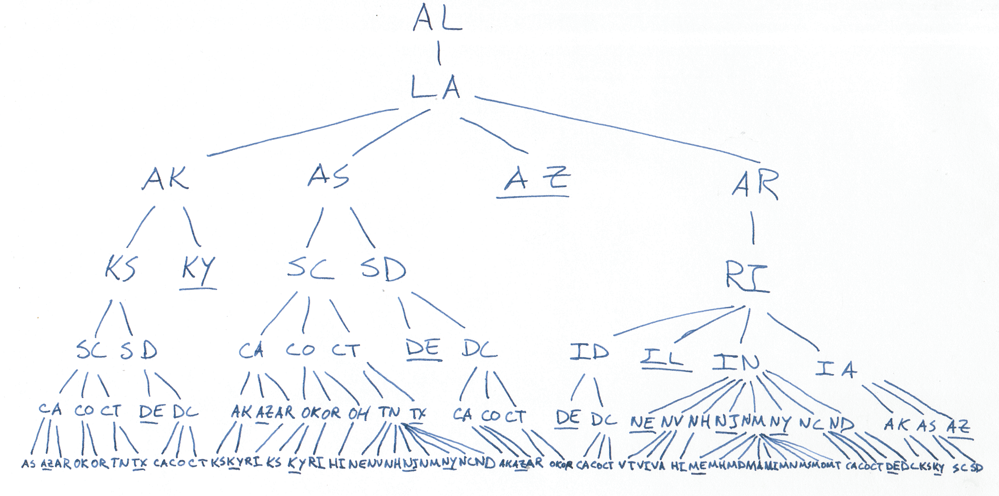

# Problem statement
[Original
article](https://fivethirtyeight.com/features/can-you-help-dakota-jones-raid-the-lost-arc/)

> The challenge is to find the longest string of letters in which (1) every
> pair of consecutive letters is a two-letter state or territory abbreviation,
> and (2) no state abbreviation occurs more than once.

# My solution
The longest chain we can make using just states and possessions is
`FMPWVAKSCTNVIARIDCOHINMNCALASDE` (31 characters).  It's not unique
(`FMNVAKSCTNMPWVIARIDCOHINCALASDE` is just as long), but there aren't any longer
chains.  My code is still running for the case including military postal
abbreviations, but working from the solution above, I can fit in
`FMAAPWVAKSCTNVIARIDCOHINMNCALASDE` (33 characters).

UPDATE: My code finished (too late), but including the military postal
abbreviations, the longest chain is `FMPAKSCTNVAPWVIARIDCOHINMNCALAASDE` (34
characters).

# How I did it

Clojure code is in [`classic.clj`](./classic.clj) in this directory.

We can represent the possible sequences of states as a tree (see the
illustration below).  To figure out what states can come next in a sequence, we
only need to know the most recent state in the sequence and the states that
haven't yet been used.  [This makes recursion the natural
solution.](http://sarabander.github.io/sicp/html/2_002e2.xhtml#g_t2_002e2_002e2)



The meat of the computation is in the `abbreviation-tree` function, in
pseudocode as follows:

1. If none of the available states starts with the last letter of the most
   recent state, this node has no children.
2. Otherwise, the children of this node are those trees generated by this
   process, applied to the states that match the most recent state.

I found it easier to implement if I included the entire sequence represented in
each leaf, but the construction works in the same way.

We can walk the tree to check all the possible sequences and keep the longest.
This tree gets pretty big pretty quickly, though, so we can't just build the
tree in memory.  Instead, I made the tree out of Clojure's lazy sequences, so
we only load the node of the tree that we're currently checking.

The code generates the following output:

```
Including only state/possessions:
The longest chain we can make is:
FMPWVAKSCTNVIARIDCOHINMNCALASDE

The longest for each state is:
AK : AKSCTNVARIALASDCOHINMPWVIDE
AL : ALAKSCTNVARIASDCOHINMPWVIDE
AR : ARIAKSCTNVALASDCOHINMPWVIDE
AS : ASCTNVAKSDCOHIALARINMPWVIDE
AZ : AZ
CA : CAKSCTNVARIALASDCOHINMPWVIDE
CO : COHIAKSCTNVARINMPWVIDCALASDE
CT : CTNVAKSCARIALASDCOHINMPWVIDE
DC : DCTNVAKSCOHIARINMPWVILASDE
DE : DE
FL : FLAKSCTNVARIASDCOHINMPWVIDE
FM : FMPWVAKSCTNVIARIDCOHINMNCALASDE
GA : GAKSCTNVARIALASDCOHINMPWVIDE
GU : GUTNVAKSCARIALASDCOHINMPWVIDE
HI : HIAKSCTNVARINMPWVILASDCOKY
IA : IAKSCTNVARILASDCOHINMPWVIDE
ID : IDCTNVAKSCOHIARINMPWVILASDE
IL : ILAKSCTNVARIASDCOHINMPWVIDE
IN : INVAKSCTNMPWVIARILASDCOHIDE
KS : KSCTNVARIALASDCOHINMPWVIDE
KY : KY
LA : LAKSCTNVARIASDCOHINMPWVIDE
MA : MAKSCTNVARIALASDCOHINMPWVIDE
MD : MDCTNVAKSCOHIARINMPWVILASDE
ME : ME
MH : MHIAKSCTNVARINMPWVILASDCOKY
MI : MIAKSCTNVARILASDCOHINMPWVIDE
MN : MNVAKSCTNMPWVIARIDCOHINCALASDE
MO : MOKSCTNVARIALASDCOHINMPWVIDE
MP : MPWVAKSCTNVIARIDCOHINMNCALASDE
MS : MSCTNVAKSDCOHIALARINMPWVIDE
MT : MTNVAKSCARIALASDCOHINMPWVIDE
NC : NCTNVAKSCARIALASDCOHINMPWVIDE
ND : NDCTNVAKSCOHIARINMPWVILASDE
NE : NE
NH : NHIAKSCTNVARINMPWVILASDCOKY
NJ : NJ
NM : NMPWVAKSCTNVIARIDCOHINCALASDE
NV : NVAKSCTNMPWVIARIDCOHINCALASDE
NY : NY
OH : OHIAKSCTNVARINMPWVILASDCOKY
OK : OKSCTNVARIALASDCOHINMPWVIDE
OR : ORIAKSCTNVALASDCOHINMPWVIDE
PA : PAKSCTNVARIALASDCOHINMPWVIDE
PR : PRIAKSCTNVALASDCOHINMPWVIDE
PW : PWVAKSCTNVIARIDCOHINMNCALASDE
RI : RIAKSCTNVALASDCOHINMPWVIDE
SC : SCTNVAKSDCOHIALARINMPWVIDE
SD : SDCTNVAKSCOHIALARINMPWVIDE
TN : TNVAKSCARIALASDCOHINMPWVIDE
TX : TX
UT : UTNVAKSCARIALASDCOHINMPWVIDE
VA : VAKSCTNMPWVIARIDCOHINCALASDE
VI : VIAKSCTNMPWVARIDCOHINCALASDE
VT : VTNVAKSCARIALASDCOHINMPWVIDE
WA : WAKSCTNVARIALASDCOHINMPWVIDE
WI : WIAKSCTNVARILASDCOHINMPWVIDE
WV : WVAKSCTNVIARILASDCOHINMPWIDE
WY : WY


Including the military postal abbreviations:
The longest chain we can make is:
FMPAKSCTNVAPWVIARIDCOHINMNCALAASDE

The longest for each state is:
AA : AAKSCTNVAPWVIARIDCOHINMNCALASDE
AE : AE
AK : AKSCTNVAPWVIARIDCOHINMNCALAASDE
AL : ALAKSCTNVAPWVIARIDCOHINMNCAASDE
AP : APWVAKSCTNVIARIDCOHINMNCALAASDE
AR : ARIAKSCTNVAPWVIDCOHINMNCALAASDE
AS : ASCTNVAKSDCAPWVIALAARINMNCOHIDE
AZ : AZ
CA : CAKSCTNVAPARIALAASDCOHINMPWVIDE
CO : COHIAKSCTNVAPARINMPWVIDCALAASDE
CT : CTNVAKSCAPARIALAASDCOHINMPWVIDE
DC : DCTNVAKSCAPWVIARINMNCOHILAASDE
DE : DE
FL : FLAKSCTNVAPWVIARIDCOHINMNCAASDE
FM : FMPAKSCTNVAPWVIARIDCOHINMNCALAASDE
GA : GAKSCTNVAPWVIARIDCOHINMNCALAASDE
GU : GUTNVAKSCAPARIALAASDCOHINMPWVIDE
HI : HIAKSCTNVAPWVILARINMNCAASDCOKY
IA : IAKSCTNVAPWVILARIDCOHINMNCAASDE
ID : IDCTNVAKSCAPWVIARINMNCOHILAASDE
IL : ILAKSCTNVAPWVIARIDCOHINMNCAASDE
IN : INVAKSCTNMNCAPWVIARILAASDCOHIDE
KS : KSCTNVAPWVIARILASDCOHINMNCAAKY
KY : KY
LA : LAKSCTNVAPWVIARIDCOHINMNCAASDE
MA : MAKSCTNVAPWVIARIDCOHINMNCALAASDE
MD : MDCTNVAKSCAPWVIARINMNCOHILAASDE
ME : ME
MH : MHIAKSCTNVAPWVILARINMNCAASDCOKY
MI : MIAKSCTNVAPWVILARIDCOHINMNCAASDE
MN : MNVAKSCTNMPAPWVIARIDCOHINCALAASDE
MO : MOKSCTNVAPWVIARILASDCOHINMNCAAKY
MP : MPAKSCTNVAPWVIARIDCOHINMNCALAASDE
MS : MSCTNVAKSDCAPWVIALAARINMNCOHIDE
MT : MTNVAKSCAPARIALAASDCOHINMPWVIDE
NC : NCTNVAKSCAPARIALAASDCOHINMPWVIDE
ND : NDCTNVAKSCAPWVIARINMNCOHILAASDE
NE : NE
NH : NHIAKSCTNVAPWVILARINMNCAASDCOKY
NJ : NJ
NM : NMPAKSCTNVAPWVIARIDCOHINCALAASDE
NV : NVAKSCTNMPAPWVIARIDCOHINCALAASDE
NY : NY
OH : OHIAKSCTNVAPWVILARINMNCAASDCOKY
OK : OKSCTNVAPWVIARILASDCOHINMNCAAKY
OR : ORIAKSCTNVAPWVIDCOHINMNCALAASDE
PA : PAKSCTNVAPWVIARIDCOHINMNCALAASDE
PR : PRIAKSCTNVAPWVIDCOHINMNCALAASDE
PW : PWVAKSCTNVIAPARIDCOHINMNCALAASDE
RI : RIAKSCTNVAPWVIDCOHINMNCALAASDE
SC : SCTNVAKSDCAPWVIALAARINMNCOHIDE
SD : SDCTNVAKSCAPWVIALAARINMNCOHIDE
TN : TNVAKSCAPARIALAASDCOHINMPWVIDE
TX : TX
UT : UTNVAKSCAPARIALAASDCOHINMPWVIDE
VA : VAKSCTNVIAPWILARIDCOHINMNCAASDE
VI : VIAKSCTNVAPWILARIDCOHINMNCAASDE
VT : VTNVAKSCAPARIALAASDCOHINMPWVIDE
WA : WAKSCTNVAPWVIARIDCOHINMNCALAASDE
WI : WIAKSCTNVAPWVILARIDCOHINMNCAASDE
WV : WVAKSCTNVIAPWILARIDCOHINMNCAASDE
WY : WY
```
