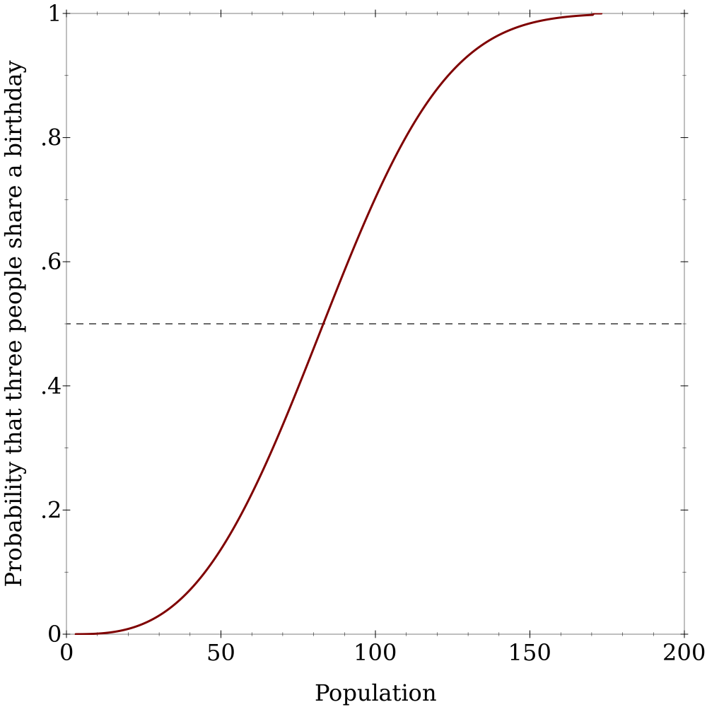

# Problem statements

[Original article](
https://fivethirtyeight.com/features/who-wants-to-be-a-riddler-millionaire/)

Express:

>Out of the four choices, A, B, C and D, you’re 70 percent sure the answer is B,
>and none of the remaining choices looks more plausible than another. You decide
>to use your final lifeline, the 50:50, which leaves you with two possible
>answers, one of them correct. Lo and behold, B remains an option! How confident
>are you now that B is the correct answer?

Classic:

> How many people do you need to have better-than-even odds that at least three
> of them have the same birthday? (Again, ignore leap years.)


# My answer - Express

With the new information, I believe the answer is B with probability **7/8**, or
**87.5%**.

# How I did it - Express

Let Φ refer to the scenario in which B is not eliminated by the 50/50.  By
Bayes' theorem, `Pr(B | Φ) = Pr(Φ | B) * Pr(B) / Pr(Φ)`.  The 50/50 lifeline
can't eliminate a correct answer, so `Pr(Φ | B) = 100%`.  From the problem
statement, our prior probability that the answer is B is `Pr(B) = 70%`.  

By the law of total probability, and substituting in the above:
```
Pr(Φ) = Pr(Φ | B) * Pr(B) + Pr(Φ | ¬B) * Pr(¬B)
      = 100%      * 70%   + Pr(Φ | ¬B) * 30%
```

There are always three incorrect answers and therefore `3 choose 2 = 3` ways to
pick two to eliminate.  When B is one of the wrong answers, two of those
combinations include B and one doesn't.  Since the 50/50 lifeline chooses from
those combinations with uniform probability, `Pr(Φ | ¬B) = 1/3`.  Substituting
into the above, we get `Pr(Φ) = 80%`, and substituting back into Bayes' theorem,
we get:
```
Pr(B | Φ) = 100% * 70% / 80%
          = 7/8
```

# My answer - Classic

You need at least 84 people to get better-than-even odds that some combination
of three people will have the same birthday.

# How I did it - Classic

```
Pr(N people share a birthday) = 1/365 * Pr(N-1 people share a birthday)
Pr(1 person has the same birthday as himself) = 1
Pr(N people share a birthday) = (1/365)^(N-1)
Pr(3 people share a birthday) = (1/365)^2
Pr(3 people don't share a birthday) = 1 - (1/365)^2
Pr(Of M people, no 3 people share a birthday) = (1 - (1/365)^2)^(M choose 3)
Pr(Of M people, some 3 people share a birthday) = 1 - (1 - (1/365)^2)^(M choose 3)
```
The smallest integer M for which this probability exceeds 50% is 84 people.


