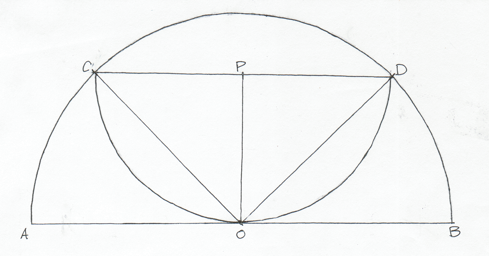

# Express

https://fivethirtyeight.com/features/how-low-can-you-roll/

The darker region (the smaller semicircle) has an area of 7.

# Proof

It's not explicit in the diagram, but we'll need two assumptions:

1. The corners of the smaller semicircle (marked as C and D below) lie on the
   arc of the larger semicircle.

2. The arc of the smaller semicircle lies tangent to the diameter of the larger
   semicircle at its midpoint (marked as O below).





Draw lines OP, OC, and OD.  Lines OC and OD are radii of semicircle O, so
they're equal.  Lines PC and PD are radii of semicircle P, so they're equal.
Line OP equals itself, so since all their sides are equal, triangles △OPC and
△OPD are congruent.  This means angles ∠OPC and ∠OPD are congruent, and since
they add to a straight angle ∠CPD, they're right angles.  Lines PC and OP are
both radii of semicircle P, so they're equal, and they subtend a right angle
∠OPC, so △OPC is a 45-45-90 triangle.  Therefore, the ratio of OC to OP is √2,
and since these are radii of semicircles O and P, respectively, the ratio of
the areas of the semicircles is 2.  From there, it's just a bit of algebra:

```
Area(dark)     = Area(small)
               = Area(large) / 2
               = (Area(dark) + Area(light)) / 2
2 * Area(dark) = Area(dark)  + Area(light)
Area(dark)     = Area(light)
               = 7
```
